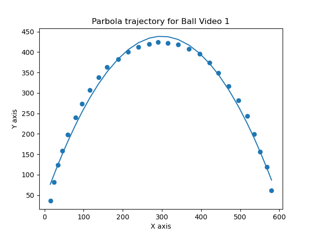
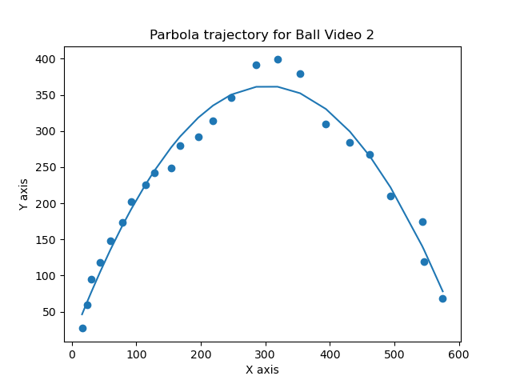

# ball-tracking-and-trajectory-curve-fitting
A python project using OpenCv to track a ball and fit a curve to find its trajectory.

#Results:

1. Curve trajectory when the ball is tracked properly

1. Curve trajectory when the ball is not tracked properly due to sensor issues

